# Chatbot de qualification — configuration et exploitation

## Structure et réutilisation

Netlify publie **flemme-web-beta/** (voir netlify.toml à la racine); les autres sites sont
historiques. Le chatbot s’affiche dans #offer, quand une demande est créée, uniquement
si QUALIFICATION_ENABLED=true lors du build. Sans activation ou sans accord pour OpenAI,
le formulaire Netlify Forms existant reste utilisable, avec ses fichiers et son vocal.
La version mobile Capacitor garde ce parcours manuel.

Le dossier flemme-managerV1 est repris du commit
371dbc4f81be7074539fd4048e75c32cda7f3e25 de feature/flemme-manager-v1 : FastAPI,
Agents SDK, modèle gpt-4.1-mini, catalogue de workflows, instructions et validation de
cohérence. Il n’était pas présent sur main. Les anciens modules d’exécution étaient
vides. Cette branche ajoute les conversations et les agents de **préparation**;
elle ne fournit pas un service d’achat, d’appel, de réservation ou de recherche web.

```mermaid
flowchart LR
  Site[Formulaire et chatbot] --> Proxy[Fonction Netlify]
  Proxy --> API[FastAPI + SQLite]
  API --> Qual[Manager V1 + qualification]
  Qual --> Review[Récapitulatif confirmé par client]
  Review --> Human[Validation équipe]
  Human --> Queue[File de préparation]
  Queue --> Agents[search / compare / quality / writer]
  Agents --> Result[Résultat à relire par équipe]
```



## Instructions, faits et outils

prompts/manager.txt garde le catalogue fermé et les règles de prudence;
prompts/qualification.txt ajoute la mémoire progressive, les corrections explicites,
le traitement des messages comme données non fiables et les champs structurés.
Le SDK retourne QualificationAssessment (ManagerAssessment + MissionFacts).
Le serveur vérifie la cohérence catégorie/workflow/statut puis les faits requis.

| Workflow | Champs indispensables | Étapes préparatoires |
| --- | --- | --- |
| comparer_devis | besoin, détails des devis, critères | compare → quality → writer |
| trouver_prestataire | besoin, lieu, budget, échéance | search → quality → writer |
| rechercher_produit | besoin, budget, critères | search → compare → quality → writer |
| organiser_voyage | besoin, destination, budget, dates, contraintes/voyageurs | search → compare → quality → writer |

Les réponses explicites « sans échéance » ou « budget à définir par devis » sont
acceptées. Les questions viennent du serveur (deux au maximum) et des questions du
manager s’il lui manque encore des informations. Des faits sont proposés par le modèle,
pas garantis vrais : le client relit le récapitulatif et l’équipe vérifie ensuite la mission.

Les outils applicatifs sont déterministes et restent **hors du contrôle du modèle** :
qualification_summary valide les champs et calcule la route; Store gère les messages,
versions et autorisations; mission_service.decide crée une seule mission autorisée;
claim et complete permettent une prise en charge séquentielle par les exécutants.
Les agents SDK n’ont aucun outil à effet externe. search prépare un plan de recherche
sans effectuer de recherche web; compare utilise uniquement les options fournies;
quality contrôle les hypothèses; writer rédige le résultat préparatoire.
Les pièces jointes et le vocal restent dans le parcours existant; leur contenu n’est
ni parsé ni envoyé à OpenAI. Copier les détails utiles dans l’échange ou laisser l’équipe
les examiner. Ajouter un outil externe nécessitera sa propre validation humaine et
ses tests avant toute activation.

## États et validations

La conversation suit qualifying → pending_human → queued → completed, ou rejected.
Le statut du manager (ready, needs_information, out_of_catalog,
human_intervention_required) reste distinct de cette progression.
Une demande incomplète ne peut pas être confirmée. Une demande hors catalogue ou
signalée pour intervention humaine peut être transmise à l’équipe, mais ne peut pas
entrer dans la file automatique. L’équipe la traite manuellement ou la refuse.

Le client confirme un **numéro de version précis** du récapitulatif. Toute correction
de la conversation ou des précisions du formulaire exige une nouvelle relecture.
Le contact est ajouté après confirmation et n’est pas envoyé au manager ni aux
exécutants. La référence FL-… et qualification_id relient la mission au formulaire Netlify.
Le formulaire n’envoie jamais le jeton de conversation.

Les appels messages sont idempotents avec request_id : réutiliser le même identifiant
et le même texte après une réponse perdue. Les réservations ont une version qui empêche
un ancien appel de remplacer un résultat plus récent. L’état confirmé ne peut plus être
modifié par un message utilisateur. Une nouvelle demande constitue une nouvelle mission.

La confirmation API **précède** l’envoi Netlify : si Netlify échoue, la mission reste
pending_human dans l’API et les coordonnées y sont disponibles; réessayer utilise la
même mission et la même référence. Ces deux services ne partagent pas de transaction.
L’équipe doit vérifier le formulaire/fichiers associés avant approbation; une mission
sans formulaire reçu doit être traitée avec précaution. Une réponse Netlify perdue
peut entraîner un doublon de formulaire; dédupliquer avec référence + qualification_id.

## Configuration API (secrets serveur)

Depuis flemme-managerV1, copier .env.example en .env, puis configurer les variables
avec le gestionnaire de secrets du serveur. Ne jamais versionner .env ou une clé.
Le secret OpenAI créé par Codex est dans le fichier local confirmé, **hors du dépôt**;
le connecter au processus local avec --env-file si nécessaire. Il expire 30 jours
après sa création; prévoir son renouvellement sans l’inscrire dans GitHub.

| Variable | Destination / rôle |
| --- | --- |
| OPENAI_API_KEY | API et workers uniquement |
| OPENAI_MODEL | gpt-4.1-mini par défaut, modèle existant conservé |
| FLEMME_SERVICE_KEY | même secret aléatoire sur Netlify et API, pour le proxy |
| FLEMME_OPERATOR_KEY | secret distinct, équipe et API uniquement |
| FLEMME_EXECUTOR_KEY | secret distinct, workers et API uniquement |
| FLEMME_DATABASE_PATH | fichier SQLite sur **volume persistant**, hors publication |
| FLEMME_RETENTION_DAYS | 30 par défaut; mettre à jour la politique si changé |
| FLEMME_DAILY_MODEL_LIMIT | 300 par défaut; créations + analyses comptent dans ce plafond |
| PORT | port HTTP de l’hébergeur; 8000 en local |

Générer chaque secret applicatif distinct avec secrets.token_urlsafe(32) et le saisir
directement dans les gestionnaires de secrets. Aucun secret ne doit aller dans content.js,
les variables publiques, un navigateur, une URL, un log ou une capture.
L’API échoue en 503 si le secret correspondant manque; un secret invalide renvoie 401.
L’ancien POST /api/manager/analyze est désormais également protégé par la clé service.
Ne pas activer CORS pour des origines arbitraires : le navigateur utilise le proxy même origine.

```sh
uv sync --frozen --extra dev
uv run uvicorn flemme_manager.main:app --host 127.0.0.1 --port 8000
uv run pytest
```

Le conteneur Dockerfile écoute PORT et expose /health, sans auto-démarrer de worker.
Monter un volume persistant sur /data appartenant à UID 10001; garder une seule instance
API (plusieurs workers de processus possibles). SQLite fournit les transactions et la
file durable, mais n’est pas destiné à des réplicas répartis sur plusieurs machines.
Ne pas utiliser un disque éphémère de fonction serverless pour l’API. Pour plusieurs
instances, migrer Store et la file vers une base transactionnelle partagée avant de scaler.
Les privilèges et les résultats sont isolés des tables Supabase accessibles au frontend.

## Netlify : preview puis validation explicite

La fonction netlify/functions/qualification.mjs est routée sur /api/qualification/*.
Elle transmet seulement les routes conversation autorisées; les routes operator,
executor et manager ne sont pas publiques via ce proxy. Origin est contrôlé, les corps
ont une limite stricte de 12 Ko et les réponses ne sont jamais mises en cache.
L’identité IP provient du contexte Netlify, pas d’un en-tête utilisateur.

Configurer **uniquement dans un contexte de preview approuvé** :

- QUALIFICATION_ENABLED=true (build ET fonctions).
- FLEMME_API_URL=https://api-preview.example.org (origine HTTPS sans chemin).
- FLEMME_SERVICE_KEY identique à celui de l’API preview (fonctions uniquement).
- Ne pas donner OPENAI_API_KEY, FLEMME_OPERATOR_KEY ou FLEMME_EXECUTOR_KEY au site.
- Utiliser une API/base preview séparée; ne pas faire pointer une preview sur la base production.

La réponse OpenAI est limitée à 40 secondes et le proxy à 45 secondes, en deçà de la
[limite synchrone Netlify documentée](https://docs.netlify.com/build/functions/configuration/) de 60 secondes.
Le build node build.js publie uniquement le booléen enabled. Le service worker ignore
/api/ et sa version change pour charger le nouveau widget. Le Content Security Policy
existant conserve connect-src 'self'; aucune connexion OpenAI depuis le navigateur.
Les configurations Netlify existantes à la racine et dans le site restent valides.

Cette PR ne change aucun hébergement ni variable Netlify. **Ne pas merger, déployer ou
activer en production sans validation explicite.** Après validation : provisionner l’API
HTTPS, tester /health et les routes protégées, configurer une preview, vérifier le parcours,
compléter les mentions/confidentialité et les durées des sous-traitants, puis approuver
séparément la mise en production. Désactiver QUALIFICATION_ENABLED et reconstruire
le site pour revenir au formulaire manuel; le proxy doit aussi être désactivé.

## Opérateurs et exécutants

GET /api/operator/missions, avec X-Flemme-Operator-Key, liste les missions en attente.
GET /api/operator/missions/{id} donne conversation, contact, état, résultats et audit.
Après relecture, POST /api/operator/missions/{id}/decision reçoit :

```json
{"approve": true, "reason": "Besoin, budget et périmètre vérifiés avec le client"}
```

Une approbation est idempotente et produit un seul job, avec schema_version,
workflow, faits, critères, agents ordonnés et permissions.external_actions=false.
Un refus utilise approve=false. Le secret opérateur n’est jamais exposé sur equipe.html;
l’interface opérateur reste l’API protégée, à utiliser dans un outil serveur interne.
L’audit identifie le rôle operator; une identité nominative par personne nécessitera
une authentification équipe additionnelle avant un usage à grande échelle.

Les workers peuvent intégrer POST /api/executor/claim/{agent}, puis
POST /api/executor/jobs/{id}/complete avec lease_token et result. Une seule étape est
prise en charge à la fois; le bail dure 120 secondes. Les résultats d’un ancien bail sont
refusés. Les traitements sont répétables à expiration, donc limités à de la préparation
sans effet externe. Une erreur worker laisse le bail expirer, sans prétendre avoir terminé.
Le token d’exécuteur représente un service de confiance, pas une identité utilisateur.

Pour lancer une étape explicitement après approbation (depuis un serveur configuré) :

```sh
uv run python -m flemme_manager.worker search --api https://api-preview.example.org
uv run python -m flemme_manager.worker quality --api https://api-preview.example.org
uv run python -m flemme_manager.worker writer --api https://api-preview.example.org
```

Les agents ne sont pas démarrés par une visite de page ni par un déploiement. Le résultat
final reste dans GET operator/missions/{id} et doit être relu par l’équipe; aucune publication
ou communication automatique. Les coûts des workers sont à limiter par un budget OpenAI
et par la cadence du service worker; le plafond API local couvre créations/qualification,
pas les appels OpenAI effectués par les workers.

## Persistance, confidentialité et exploitation

La base conserve l’historique et la mission; seul le hash du jeton de conversation est
stocké. Le navigateur garde id + token dans sessionStorage, pas les réponses. Le texte
initial du formulaire conserve son mécanisme de brouillon historique. Le jeton n’autorise
que sa propre conversation; les réponses API sont no-store. Les traces SDK sont désactivées
et les requêtes modèle demandent store=false. Cela ne remplace pas les politiques de
rétention du fournisseur. Les prompts interdisent les secrets mais ne constituent pas
un filtre DLP; ne pas envoyer de contenu sensible.

Le fichier SQLite est créé en mode 0600, dans un répertoire créé en 0700; les suppressions
activent secure_delete. Le chiffrement au repos du volume, ses sauvegardes et l’accès de
l’hébergeur restent à configurer par l’exploitant. Ne pas logger les corps, Authorization
ou les secrets de service. Les jetons Bearer stockés dans l’onglet dépendent de la sécurité
contre les scripts malveillants : les textes sont rendus par textContent et le CSP est conservé.

La rétention expire après 30 jours depuis la création (configurable). La purge est effectuée
à l’utilisation et doit aussi être planifiée quotidiennement par l’hébergeur :

```sh
uv run python -m flemme_manager.retention
```

L’effacement client est possible avant queued. Après prise en charge, une demande de retrait
passe par l’équipe. Purger aussi les sauvegardes à leur échéance; effacer une conversation
API n’efface pas les formulaires Netlify, les fichiers ou les données Supabase associés.
L’API limite les messages à 1 500 caractères, 20 échanges environ, 24 000 caractères
cumulés, et 40 créations/analyses par identité/jour (deux compteurs distincts).
Le plafond global inclut les appels échoués pour empêcher des boucles coûteuses.
Configurer en plus les limites de dépense OpenAI et une protection anti-abus/WAF
Netlify si le trafic public augmente; les quotas IP seuls ne résistent pas à des IP multiples.

## Tests reproductibles

Depuis la racine :

```sh
uv run --project flemme-managerV1 --extra dev pytest flemme-managerV1/tests
node --test tests/qualification-proxy.test.mjs
pnpm install --frozen-lockfile
pnpm exec playwright install chromium
```

Le test navigateur utilise les vraies routes FastAPI, SQLite et frontend. Seuls le modèle
et Netlify Forms sont simulés. Démarrer la fixture locale dans un terminal, avec un nouveau
fichier de base pour chaque passage, puis lancer le test dans un second terminal :

```sh
FLEMME_DATABASE_PATH=/tmp/flemme-e2e-new.sqlite3 PYTHONPATH=tests \
  uv run --project flemme-managerV1 --extra dev uvicorn e2e_app:app --port 8765
pnpm run test:browser
```

CHROME_PATH permet d’utiliser un Chrome installé; E2E_URL permet un autre port.
La fixture tests/e2e_app.py utilise des clés factices et n’est jamais un point d’entrée de
production. Les tests couvrent consentement, champs requis, histoire progressive,
versions, retries, accès inter-conversations, quotas, erreurs masquées, intervention humaine,
expiration, suppression, bail de worker, ordre des agents et absence d’action externe.
Les tests du proxy vérifient les origines, routes, taille, secrets et erreurs réseau.
Le test navigateur vérifie aussi recharge, correction/relecture et échec Netlify puis retry.

Test réel OpenAI facultatif, avec un exemple synthétique et une clé configurée :

```sh
uv run --project flemme-managerV1 python flemme-managerV1/tests/live_qualification.py
```

Il effectue deux appels limités, ne contacte aucun client et ne publie rien. Les tests
unitaires/intégration habituels ne nécessitent ni clé réelle ni accès réseau.

Documentation officielle utilisée :
[Agents SDK](https://developers.openai.com/api/docs/guides/agents/sdk) et
[Structured outputs](https://developers.openai.com/api/docs/guides/structured-outputs).
